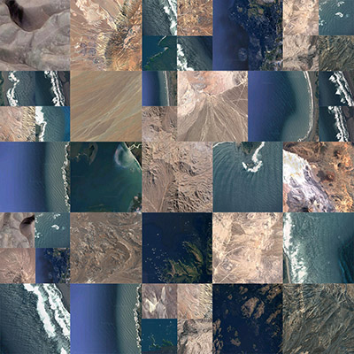

## La ilusión de los mapas / Generative Music (performance #1)

Pinochet’s dictorship in Chile left a total of 40.000 victims, from which 3000 where detained and then never found again. There still no certainty to what happened to all this people. It is assumed that they are dead, but there has been no information on the whereabouts of their remains. Official entities have up to this date not release information on what exactly happened to these people, but a few ex-officials involved with the tortures and killings have given out some leads to what they did to them and how they got rid of the bodies. It has been said that the bodies were thrown to the open ocean with train reals attached to them so that they would sink, and also that they were torn apart and spread around the Atacaman dessert. The chilean coast messeaures 6435 km ( 3998 mi) long and the chilean sea territory spreads over more than 3 million km²  (1.8 million mi²). The Atacaman dessert, which is the driest dessert in the world, has an area of 105.000 km² (65,000 mi²). Besides how impossible big these places are, relatives of the victim are still today undertaking selg-managed tracking operations with the hope that they’ll find some hint of what happened to their love ones. 

For this performance I decided to make a data sonification from the list of “Detenidos Desaparecidos” (The Dissapeared Detaines), victims of the Chilean dictatorship that took place between 1973 and 1989. 
I selected a sample of 100 names, out of a full pdf file with a list of approx. 1300 names of Detenidos Desaparecidos.
I’ve sorted the data in python so that it created a midi file with an array of notes, where each note represent a person. Their ages are mapped to the tone of the note, and the instance they were when they were taken away is mapped to the volume of the note. 
Then I’m running a p5.js sketch where I’ve composed a grid of satellite views of the chilean dessert and sea. The sketch is receiving the midi input from museScore and each note (each person dissapeared) clears out a fragment of the geographic background.

The music aspect of this piece is conceibed in a way that points out to identity and also to the urgency of the instance of beign taken away. The visual asset is meant to highlight the intricated relation between identity, memory and territory. These people are there, but at the same time, they are not. Their pressence weighs down on the landscape, but they can never be reached. The illusion of maps is revealed. 

